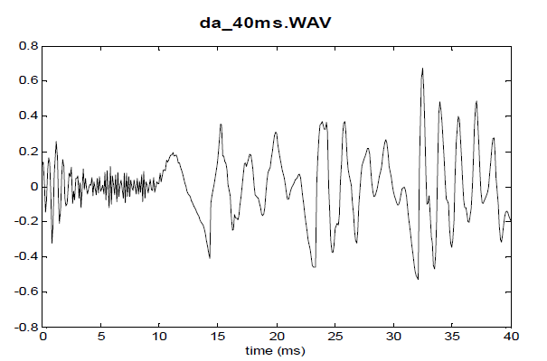
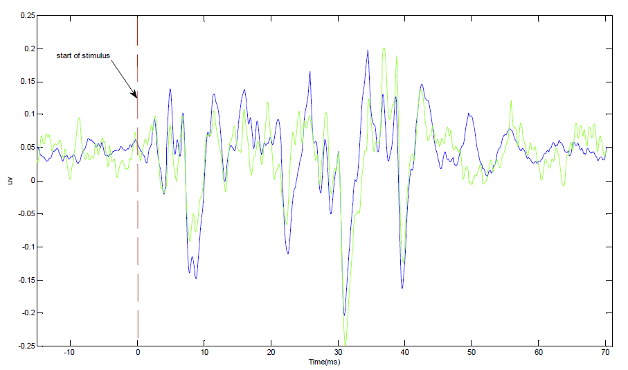

# SVM-clasification-for-ADHD-and-neurotypical-children

Attention Deficit Hyperactivity Disorder (ADHD) is a common disorder in children. 
Due to lack of suitable biomarker or test, diagnosis of ADHD children is complicated and needs comprehensive evaluations.
Evidences show that, ADHD children have deficit in their brainstem timing and cortex auditory processing. We assessed their auditory brainstem response to speech stimuli.

Speech stimuli is sound /da/. Image bellow shows the stimuli:

and the response to auditory stimuli has impoportant peaks as marker of auditory processing in brainstem:

and this is the signal recorded for ADHD (blue line) and normal child (green line):

In this project, support vector machine was used classify ADHD from neurotypical children.

